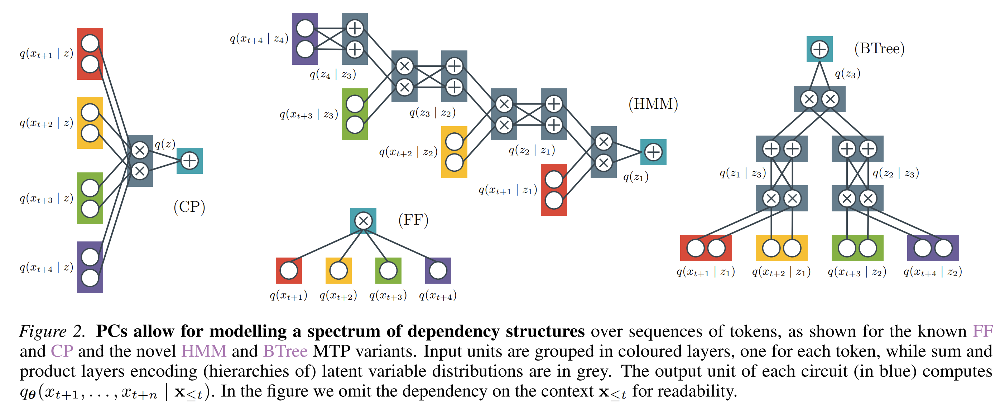
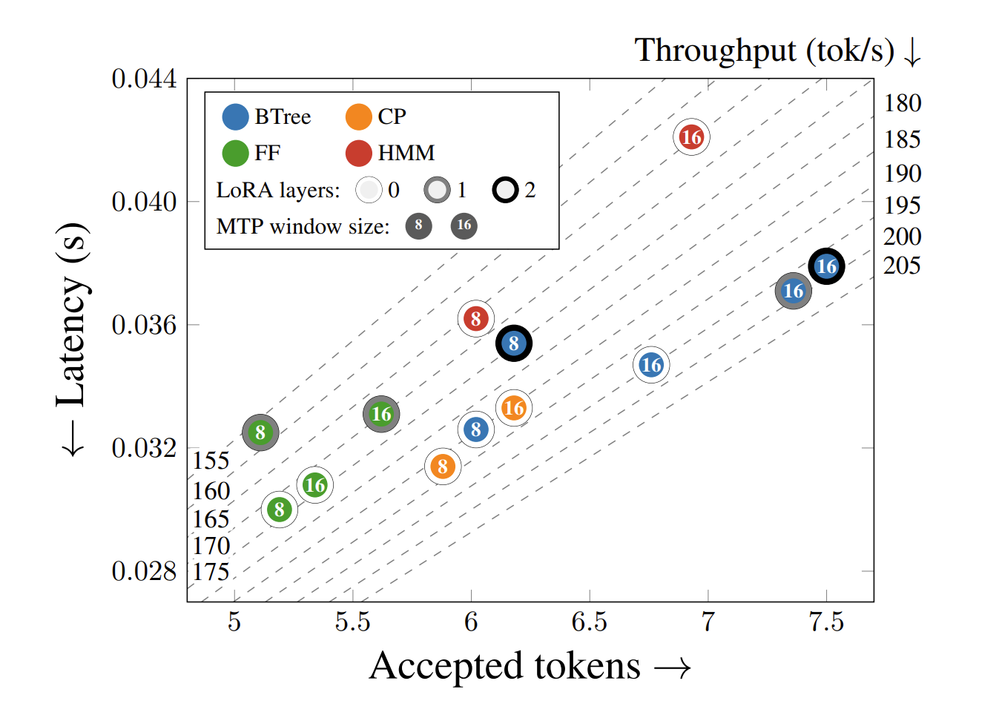

# [Fast and Expressive Multi-Byte Prediction with Probabilistic Circuits](https://arxiv.org/abs/2511.11346)

**MTPC (Multi-Token Prediction with Circuits)** is a framework for training [probabilistic circuit](https://github.com/april-tools/cirkit)-based MTP heads on top of frozen byte-level LLMs, such as [EvaByte](https://huggingface.co/EvaByte/EvaByte-SFT) and [Llama3-2-3B-IT-Byte](https://huggingface.co/benjamin/Llama3-2-3B-IT-Byte), enabling speculative decoding without a separate draft model.

<p align="center">
  
</p>

- **Circuit architectures** include fully-factorised (ff), mixture models (cp), Hidden Markov Models (hmm), and binary tree (btree). These are parametrised by window size n and number of mixture components r. Pre-trained models for various configurations are available on HuggingFace (see [No-LoRA models](#no-lora-models) and [LoRA models](#lora-models)).
- **Text Generation supports three modes**: i) Single-token prediction (stp), multi-token prediction (mtp), and speculative decoding (mtp + `--speculative`), where the MTP heads draft candidates verified by the base model. Speculative decoding is either greedy decoding, if the flag `--argmax` is passed, or sampling otherwise.
- **Training follows a distillation workflow**: We retrofit an STP model into an MTP model by training on the same data. A small Shakespeare example is provided for quick sanity checks, and larger runs retrofit EvaByte/Llama on Tulu 3 data.

**MTPC allows us to navigate the latency/expressiveness trade-off by choosing a) the circuit, b) the MTP window size, c) the number of mixture components and d) the number of LoRA adaptor layers on the draft model.**

<p align="center">
  
</p>

# Setup:

## Download code

```bash
git clone GITHUB_URL && cd mtpc
```

### Prepare package installation
For flash-attn build to work, set the `CUDA_HOME` env variable to point to your CUDA path

```
export CUDA_HOME=$(dirname $(dirname $(readlink -f $(which nvcc))))
```

### Environment installation using uv
```
uv venv --python 3.10
source .venv/bin/activate
uv pip install --upgrade pip setuptools wheel psutil
uv pip install flash-attn==2.8.3 --no-build-isolation
uv pip install -r requirements.txt
```

### Environment installation using pip
```
python3.10 -m venv .venv
source .venv/bin/activate
pip install --upgrade pip setuptools wheel psutil
pip install -r requirements.txt
pip install flash-attn==2.8.3 --no-build-isolation
```

## Environment Variables

All paths are configured w.r.t. the project root folder, `$MTP_ROOT`.
To set it, run the following command from the root folder:

```bash
# From root directory of the project run the following, it sets $MTP_ROOT
source env.sh
```

You may want to adapt/change:

1. The number of GPUs and device IDs (comma separated) by setting `CUDA_VISIBLE_DEVICES`.
2. Whether to use wandb or not (currently `disabled`, change to `online` for logging)


## Run Unit Tests

Running the tests can take up to one hour depending on the hardware.

```bash
export PYTHONPATH=.
pytest tests
```

# Development Notes

## Architecture Overview

### Models

The codebase is organized into three main model types:

1. **STP (Single Token Prediction)** - `mtp/models/stp.py`
   - Standard autoregressive language model wrapper

2. **MTP (Multi-Token Prediction)** - `mtp/models/mtp.py`
   - Composed of three parts:
     - **LM encoder**: Provides contextual embeddings, and should allow plug and play with hf LLMs (tested for EvaByte and Llama)
     - **mt_head**: Expands embeddings into circuit parameters
     - **Circuit**: Probabilistic model over multiple output tokens

3. **Circuits** - `mtp/models/circuits.py`
   - Implements structured probabilistic models:
     - `cp`: CP (CANDECOMP/PARAFAC) decomposition - tensor factorization
     - `hmm`: Hidden Markov Model structure
     - `btree`: Binary tree factorization
   - Uses the `cirkit` library for probabilistic circuit operations

### Data Loading

Two main data loader types in `mtp/data/`:

1. **LocalDataLoader** - For `.bin` files (e.g., Shakespeare)
2. **HFDataLoader** - For HuggingFace datasets

Data is loaded via `DistributedDataLoader.resolve()` which selects the appropriate loader based on file type.


## Configuration System (Hydra)

All configuration is managed via Hydra YAML configs in `configs/`:

- `configs/config.yaml`: Main config with defaults
- `configs/model/`: Model architectures (stp, mtp)
- `configs/lm/`: Language model configs (nanogpt, evabyte, llama)
- `configs/circuit/`: Circuit structures (cp, hmm, btree)
- `configs/mt_head/`: Multi-token head architectures
- `configs/data/`: Dataset configurations
- `configs/training/`: Training hyperparameters
- `configs/adaptor/`: LoRA and adaptation configs

**Override configs on command line:**

```bash
# Override nested config values
torchrun -m mtp.train \
    lm=evabyte \
    lm.n_layer=8 \
    training.learning_rate=0.001 \
    model.beta=0.5
```

## Checkpoint Management

- Training creates checkpoints in `logs/YYYY-MM-DD/HH-MM-SS/`
- Checkpoints are named `model@<step>.pt`
- Config is saved alongside as `config.yaml`
- Use `./bin/save_experiment` to move from logs to permanent storage


## Wandb Tracking

Training metrics are logged to wandb:
- Control with `$WANDB_MODE` environment variable
- Set to `disabled` for no logging (default in env.sh)
- Set to `online` to enable tracking


# Generate from Trained Models

## Pretrained Models

We tabulate the models we trained for the paper in the tables below, where the headings are:

- **PC** — the Probabilistic Circuit structure: `ff` = fully-factorised (cond. indep. assumption), `cp` = Mixture Model, `hmm` = Hidden Markov Model, `btree` = Binary Tree.
- **n** — the number of tokens predicted simultaneously (the MTP window size).
- **r** — the number of mixture components.
- **LoRA layers** — (RQ3 table only) how many of the draft model's final transformer layers have LoRA adapters applied; 0 means no LoRA (the continued-training baseline).
- **Llama / EvaByte** — links to the trained model on HuggingFace. The retrofitted Byte-Level LLM is [Llama3-2-3B-IT-Byte](https://huggingface.co/benjamin/Llama3-2-3B-IT-Byte) and [EvaByte-SFT](https://huggingface.co/EvaByte/EvaByte-SFT) respectively.


### <a id="no-lora-models"></a>No-LoRA Models (RQ1 & RQ2)

| PC | n | r | Llama | EvaByte |
|---|---|---|---|---|
| ff | 8 | 1 | [🤗](https://huggingface.co/agrv/llama-lr-3e-4-no-lora-ff-n-8-r-1) | [🤗](https://huggingface.co/agrv/evabyte-no-lora-lr-3e-4-no-lora-ff-n-8-r-1) |
| ff | 16 | 1 | [🤗](https://huggingface.co/agrv/llama-lr-3e-4-no-lora-ff-n-16-r-1) | [🤗](https://huggingface.co/agrv/evabyte-no-lora-lr-3e-4-no-lora-ff-n-16-r-1) |
| ff | 32 | 1 | — | [🤗](https://huggingface.co/agrv/evabyte-no-lora-lr-3e-4-no-lora-ff-n-32-r-1) |
| cp | 8 | 8 | [🤗](https://huggingface.co/agrv/llama-lr-3e-4-no-lora-cp-n-8-r-8) | [🤗](https://huggingface.co/agrv/evabyte-no-lora-lr-3e-4-no-lora-cp-n-8-r-8) |
| cp | 8 | 16 | [🤗](https://huggingface.co/agrv/llama-lr-3e-4-no-lora-cp-n-8-r-16) | [🤗](https://huggingface.co/agrv/evabyte-no-lora-lr-3e-4-no-lora-cp-n-8-r-16) |
| cp | 8 | 32 | [🤗](https://huggingface.co/agrv/llama-lr-3e-4-no-lora-cp-n-8-r-32) | [🤗](https://huggingface.co/agrv/evabyte-no-lora-lr-3e-4-no-lora-cp-n-8-r-32) |
| cp | 8 | 64 | — | [🤗](https://huggingface.co/agrv/evabyte-no-lora-lr-3e-4-no-lora-cp-n-8-r-64) |
| cp | 8 | 128 | — | [🤗](https://huggingface.co/agrv/evabyte-no-lora-lr-3e-4-no-lora-cp-n-8-r-128) |
| cp | 16 | 32 | [🤗](https://huggingface.co/agrv/llama-lr-3e-4-no-lora-cp-n-16-r-32) | [🤗](https://huggingface.co/agrv/evabyte-no-lora-lr-3e-4-no-lora-cp-n-16-r-32) |
| hmm | 8 | 32 | [🤗](https://huggingface.co/agrv/llama-lr-3e-4-no-lora-hmm-n-8-r-32) | [🤗](https://huggingface.co/agrv/evabyte-no-lora-lr-3e-4-no-lora-hmm-n-8-r-32) |
| hmm | 16 | 32 | [🤗](https://huggingface.co/agrv/llama-lr-3e-4-no-lora-hmm-n-16-r-32) | [🤗](https://huggingface.co/agrv/evabyte-no-lora-lr-3e-4-no-lora-hmm-n-16-r-32) |
| btree | 8 | 32 | [🤗](https://huggingface.co/agrv/llama-lr-3e-4-no-lora-btree-n-8-r-32-s-1) | [🤗](https://huggingface.co/agrv/evabyte-no-lora-lr-3e-4-no-lora-btree-n-8-r-32-s-1) |
| btree | 16 | 32 | [🤗](https://huggingface.co/agrv/llama-lr-3e-4-no-lora-btree-n-16-r-32-s-1) | [🤗](https://huggingface.co/agrv/evabyte-no-lora-lr-3e-4-no-lora-btree-n-16-r-32-s-1) |

### <a id="lora-models"></a>LoRA-continued Models (RQ3)

| PC | n | r | LoRA layers | Llama | EvaByte |
|---|---|---|---|---|---|
| ff | 8 | 1 | 0 | [🤗](https://huggingface.co/agrv/llama-lr-3e-4-no-lora-cont-ff-n-8-r-1) | [🤗](https://huggingface.co/agrv/evabyte-lora-continued-lr-3e-4-no-lora-cont-ff-n-8-r-1) |
| ff | 8 | 1 | 1 | [🤗](https://huggingface.co/agrv/llama-lr-3e-4-lora-last-1-cont-ff-n-8-r-1) | [🤗](https://huggingface.co/agrv/evabyte-lora-continued-lr-3e-4-lora-last-1-cont-ff-n-8-r-1) |
| ff | 8 | 1 | 2 | [🤗](https://huggingface.co/agrv/llama-lr-3e-4-lora-last-2-cont-ff-n-8-r-1) | [🤗](https://huggingface.co/agrv/evabyte-lora-continued-lr-3e-4-lora-last-2-cont-ff-n-8-r-1) |
| ff | 8 | 1 | 4 | [🤗](https://huggingface.co/agrv/llama-lr-3e-4-lora-last-4-cont-ff-n-8-r-1) | [🤗](https://huggingface.co/agrv/evabyte-lora-continued-lr-3e-4-lora-last-4-cont-ff-n-8-r-1) |
| ff | 16 | 1 | 0 | [🤗](https://huggingface.co/agrv/llama-lr-3e-4-no-lora-cont-ff-n-16-r-1) | [🤗](https://huggingface.co/agrv/evabyte-lora-continued-lr-3e-4-no-lora-cont-ff-n-16-r-1) |
| ff | 16 | 1 | 1 | [🤗](https://huggingface.co/agrv/llama-lr-3e-4-lora-last-1-cont-ff-n-16-r-1) | [🤗](https://huggingface.co/agrv/evabyte-lora-continued-lr-3e-4-lora-last-1-cont-ff-n-16-r-1) |
| ff | 16 | 1 | 2 | [🤗](https://huggingface.co/agrv/llama-lr-3e-4-lora-last-2-cont-ff-n-16-r-1) | [🤗](https://huggingface.co/agrv/evabyte-lora-continued-lr-3e-4-lora-last-2-cont-ff-n-16-r-1) |
| ff | 16 | 1 | 4 | [🤗](https://huggingface.co/agrv/llama-lr-3e-4-lora-last-4-cont-ff-n-16-r-1) | [🤗](https://huggingface.co/agrv/evabyte-lora-continued-lr-3e-4-lora-last-4-cont-ff-n-16-r-1) |
| btree | 8 | 32 | 0 | [🤗](https://huggingface.co/agrv/llama-lr-3e-4-no-lora-cont-btree-n-8-r-32-s-1) | [🤗](https://huggingface.co/agrv/evabyte-lora-continued-lr-3e-4-no-lora-cont-btree-n-8-r-32-s-1) |
| btree | 8 | 32 | 1 | [🤗](https://huggingface.co/agrv/llama-lr-3e-4-lora-last-1-cont-btree-n-8-r-32-s-1) | [🤗](https://huggingface.co/agrv/evabyte-lora-continued-lr-3e-4-lora-last-1-cont-btree-n-8-r-32-s-1) |
| btree | 8 | 32 | 2 | [🤗](https://huggingface.co/agrv/llama-lr-3e-4-lora-last-2-cont-btree-n-8-r-32-s-1) | [🤗](https://huggingface.co/agrv/evabyte-lora-continued-lr-3e-4-lora-last-2-cont-btree-n-8-r-32-s-1) |
| btree | 8 | 32 | 4 | [🤗](https://huggingface.co/agrv/llama-lr-3e-4-lora-last-4-cont-btree-n-8-r-32-s-1) | [🤗](https://huggingface.co/agrv/evabyte-lora-continued-lr-3e-4-lora-last-4-cont-btree-n-8-r-32-s-1) |
| btree | 16 | 32 | 0 | [🤗](https://huggingface.co/agrv/llama-lr-3e-4-no-lora-cont-btree-n-16-r-32-s-1) | [🤗](https://huggingface.co/agrv/evabyte-lora-continued-lr-3e-4-no-lora-cont-btree-n-16-r-32-s-1) |
| btree | 16 | 32 | 1 | [🤗](https://huggingface.co/agrv/llama-lr-3e-4-lora-last-1-cont-btree-n-16-r-32-s-1) | [🤗](https://huggingface.co/agrv/evabyte-lora-continued-lr-3e-4-lora-last-1-cont-btree-n-16-r-32-s-1) |
| btree | 16 | 32 | 2 | [🤗](https://huggingface.co/agrv/llama-lr-3e-4-lora-last-2-cont-btree-n-16-r-32-s-1) | [🤗](https://huggingface.co/agrv/evabyte-lora-continued-lr-3e-4-lora-last-2-cont-btree-n-16-r-32-s-1) |
| btree | 16 | 32 | 4 | [🤗](https://huggingface.co/agrv/llama-lr-3e-4-lora-last-4-cont-btree-n-16-r-32-s-1) | [🤗](https://huggingface.co/agrv/evabyte-lora-continued-lr-3e-4-lora-last-4-cont-btree-n-16-r-32-s-1) |

---

## Download models

The following script will download all above models.

```
# Note: if HF_TOKEN is set you may get an access error, to be sure, run
unset HF_TOKEN
./bin/download_models
```

Once these have been downloaded, they can be used below to generate text.


# Text Generation

**`python -m mtp.generate`** — Generates text using the specified model checkpoint.

- **`--checkpoint path-to-model@X.pt`** — Path to the model checkpoint at training step X.
- **`--mode mtp`** — Sets the generation mode to multi-token prediction, as opposed to standard autoregressive generation (stp).
- **`--prompt "Who was Albert Einstein?"`** — The input text to condition generation on.
- **`--print`** — Prints the generated output to stdout rather than only saving it or returning metrics.
- **`--argmax`** — Uses greedy decoding (argmax over logits at each step) instead of sampling. Combined with `--speculative`, this guarantees lossless generation (in expectation for sampling, and exactly for argmax).
- **`--num-tokens 1000`** — Generate up to 1000 tokens.
- **`--device cuda`** — Run inference on GPU.
- **`--task chat`** — Wraps the prompt in the chat template expected by EvaByte (e.g., special tokens for user/assistant turns).
- **`--use-cache`** — Enables KV-cache during generation so attention over the full prefix isn't recomputed at every step.
- **`--speculative`** — Enables speculative decoding, where the MTP heads act as the draft model: n heads propose candidate continuations in parallel and the base model's verifier head accepts or rejects them, yielding multi-token parallelism without a separate draft model.

For example:

```python
python -m mtp.generate \
    --checkpoint outputs/models/evabyte-mtpc-no-lora/evabyte-no-lora-lr-3e-4-no-lora-ff-n-8-r-1/model@900.pt \
    --mode mtp \
    --prompt "Who was Albert Einstein?" \
    --print \
    --argmax \
    --num-tokens 1000 \
    --device cuda \
    --task chat \
    --use-cache \
    --speculative
```

# Reproducing Results (Throughput Evaluation)

See the [evaluation scripts](scripts/throughput).


# Train Models

## Smol (Start here)

### Fit a NTP model
Fits a small transformer from scratch on Shakespeare char.
Useful for sanity checks as model trains in a few minutes on low-end GPUs.

```bash
# Train the default nanogpt model on shakespeare_char (see mtp/config/model/default.yaml)
torchrun --standalone \
	--nproc_per_node=1 \
	-m mtp.train \
	data=shakespeare_char \
	training=shakespeare_char  \
	model=stp  \
	lm.n_layer=4 \
	lm.n_head=4 \
	lm.n_embd=256 \
	lm.model.encoder_only=false \
	training.device_batch_size=128 \
	training.expname=my-smol-lm
```

Running the above will save the results (config and checkpoints) to a folder with the current date+time under `logs`.
Running the above should give:
```
[2025-05-22 16:23:29,775] - Setting up model... compile=True...
[2025-05-22 16:23:30,345] - Saving config and checkpoints to /disk/scratch/agrivas/nanoGPT/logs/2025-05-22/16-23-29...
[2025-05-22 16:23:30,346] - Save model: True...
[2025-05-22 16:23:30,346] - Save optimizer: True...
[2025-05-22 16:23:30,358] - Training on /disk/scratch/agrivas/nanoGPT/data/shakespeare_char/train.bin...
[2025-05-22 16:23:30,370] - Training DataLoader: total number of tokens: 1003854 across 1 files
[2025-05-22 16:23:30,370] - Validation DataLoader: total number of tokens: 111540 across 1 files
[2025-05-22 16:23:30,370] - During training we will see 524288000 tokens
[2025-05-22 16:23:30,370] - Each validation step will see 1048576 tokens
[2025-05-22 16:23:30,371] - step:0/2000 Saving model to /disk/scratch/agrivas/nanoGPT/logs/2025-05-22/16-23-29/model@0.pt...
[2025-05-22 16:23:42,167] - step:1/2000 val_loss:4.0616
[2025-05-22 16:23:42,168] - step:1/2000 train_loss:4.2427 lr:0.0004999997 time/step:9.80s
[2025-05-22 16:23:42,345] - step:2/2000 train_loss:4.0541 lr:0.0004999989 time/step:0.18s
...
[2025-05-22 16:25:12,954] - step:498/2000 train_loss:1.4269 lr:0.0004345981 time/step:0.18s
[2025-05-22 16:25:13,134] - step:499/2000 train_loss:1.4407 lr:0.0004343487 time/step:0.18s
[2025-05-22 16:25:13,540] - step:500/2000 val_loss:1.7431
[2025-05-22 16:25:13,605] - step:500/2000 Saved model to /disk/scratch/agrivas/nanoGPT/logs/2025-05-22/16-23-29/model@500.pt...
```

### Distil NTP to MTP
Now, to distil the above NTP model into a MTP model, **change** `lm.model.from_checkpoint` below to point to your generated .pt checkpoint, and run:

```bash
# Train the mtp model on shakespeare_char (see mtp/config/model/mtp.yaml)
torchrun --standalone \
	--nproc_per_node=1 \
	-m mtp.train \
	data=shakespeare_char \
	training=shakespeare_char \
	model=mtp \
	model.beta=1 \
	model.gamma=.9 \
	model.kl_algorithm=full \
	circuit=cp \
	circuit.n_token=8 \
	circuit.n_component=8 \
	mt_head=transformer \
	lm.n_layer=4 \
	lm.n_head=4 \
	lm.n_embd=256 \
	lm.model.freeze=true \
	lm.model.lm=null \
	lm.model.encoder_only=false \
	training.save_model_every=100 \
	lm.model.from_checkpoint=logs/2025-05-22/16-23-29/model@500.pt \
	training.expname=my-smol-mtp-lm
```


```
[2025-05-22 16:27:23,446] - Setting up model... compile=True...
[2025-05-22 16:27:23,821] - Saving config and checkpoints to /disk/scratch/agrivas/nanoGPT/logs/2025-05-22/16-27-22...
[2025-05-22 16:27:23,821] - Save model: True...
[2025-05-22 16:27:23,821] - Save optimizer: True...
[2025-05-22 16:27:23,837] - Training on /disk/scratch/agrivas/nanoGPT/data/shakespeare_char/train.bin...
[2025-05-22 16:27:23,844] - Training DataLoader: total number of tokens: 1003854 across 1 files
[2025-05-22 16:27:23,844] - Validation DataLoader: total number of tokens: 111540 across 1 files
[2025-05-22 16:27:23,844] - During training we will see 524288000 tokens
[2025-05-22 16:27:23,844] - Each validation step will see 1048576 tokens
[2025-05-22 16:27:23,845] - step:0/2000 Saving model to /disk/scratch/agrivas/nanoGPT/logs/2025-05-22/16-27-22/model@0.pt...
/disk/scratch/agrivas/nanoGPT/.venv/lib/python3.10/site-packages/torch/autograd/graph.py:823: UserWarning: Grad strides do not match bucket view strides. This may indicate grad was not created according to the gradient layout contract, or that the param's strides changed since DDP was constructed.  This is not an error, but may impair performance.
grad.sizes() = [1, 256, 256], strides() = [256, 256, 1]
bucket_view.sizes() = [1, 256, 256], strides() = [65536, 256, 1] (Triggered internally at /pytorch/torch/csrc/distributed/c10d/reducer.cpp:327.)
  return Variable._execution_engine.run_backward(  # Calls into the C++ engine to run the backward pass
[2025-05-22 16:27:40,214] - step:1/2000 val_loss:1.9925
[2025-05-22 16:27:40,214] - step:1/2000 train_loss:2.2567 lr:0.0004999997 time/step:10.63s
[2025-05-22 16:27:43,508] - step:2/2000 train_loss:2.0322 lr:0.0004999989 time/step:3.29s
[2025-05-22 16:27:46,803] - step:3/2000 train_loss:1.8641 lr:0.0004999975 time/step:3.29s
...
[2025-05-22 16:44:21,832] - step:298/2000 train_loss:0.9015 lr:0.0004757964 time/step:3.31s
[2025-05-22 16:44:25,149] - step:299/2000 train_loss:0.9005 lr:0.0004756367 time/step:3.31s
[2025-05-22 16:44:31,798] - step:300/2000 val_loss:0.9477
[2025-05-22 16:44:31,878] - step:300/2000 Saved model to /disk/scratch/agrivas/nanoGPT/logs/2025-05-22/16-27-22/model@300.pt...
```

Logs acts like a draft folder, to save a model under a folder named `outputs/models/<dataset>/<expname>`), run:

```bash
./bin/save_experiment --experiments logs/*
```

where you can replace * by any path match.

### Generate text from the Models

You can specify `--mode stp` to force single token prediction (even for mtp models).
For mtp models, use `--mode mtp` to generate `s` characters at a time and pass `--speculative` to enable speculative decoding.
You can also specify a prompt by using the `--prompt` parameter:

```bash
python -m mtp.generate --device cuda --checkpoint /path/to/stp/model@xxx.pt --mode stp --prompt ANTO --print
python -m mtp.generate --device cuda --checkpoint /path/to/mtp/model@xxx.pt --mode mtp --prompt ANTO --print
```

The `--mode mtp` run will generate nonsense, because mtp speeds up generation but reduces generation quality without speculative decoding.

The `--speculative` flag is not supported for the nanoGPT model because we only implemented speculative decoding with a KV-cache - and the nanoGPT architecture does not expose keys, values and queries.
For generation with speculative decoding, see the next section where we retrofit pre-trained LLM backbones.

## Large: Retrofitting EvaByte and Llama Byte

Here, instead of training our NTP LM from scratch, we take EvaByte-SFT which has been pretrained on a large corpus and fine-tuned on a data mix which includes Tulu 3.
Our current acceptance rates and throughputs have been computed on models like the above trained for approx 1-2 days without LoRA and 2-3 days with LoRA on an NVIDIA L40S GPU.

`NOTE: Some training scripts require > 40 GB GPU RAM (Especially when using LoRA)`.

#### Distil EvaByte-SFT-NTP into MTP-CP by training on Tulu 3 using a cross-entropy loss.

The CP model below with n=8, r=8 and no LoRA can be trained on an NVIDIA GeForce RTX 3090 GPU with 24 GB RAM:

```bash
torchrun --standalone \
    --nproc_per_node=$GPUS \
    -m mtp.train \
    data=tulu3-evabyte-packed \
    training=tulu3-evabyte-1epoch \
    lm=evabyte \
    model=mtp \
    circuit=cp \
    adaptor=none \
    mt_head=linear-evabyte \
    circuit.n_token=8 \
    circuit.n_component=8 \
    data.vocab_size=320 \
    model.model.beta=0 \
    model.model.gamma=0.9 \
    training.device_batch_size=1 \
    training.expname=evabyte-no-lora-cp-n-8-r-8
```

Which should output:

```
Loading checkpoint shards: 100%|███████████████████████████████████████████████████████| 3/3 [00:07<00:00,  2.34s/it]
[2026-03-29 22:34:59,415] - Setting up model... compile=True...
[2026-03-29 22:35:02,062] - Saving config and checkpoints to /home/grv/Playground/nanoGPT/logs/2026-03-29/22-34-42...
[2026-03-29 22:35:02,062] - Save model: True...
[2026-03-29 22:35:02,062] - Save optimizer: True...
[2026-03-29 22:35:02,065] - Training on agrv/tulu-v3-sft-evabyte-packed-seq-len-8192...
...
[2026-03-29 22:46:07,611] - step:1/900 train_loss:0.5687 lr:0.0003000000 time/step:595.68s
[2026-03-29 22:55:33,151] - step:2/900 train_loss:0.5481 lr:0.0003000000 time/step:565.54s
[2026-03-29 23:04:00,776] - step:3/900 train_loss:0.5220 lr:0.0003000000 time/step:507.62s
```

The model checkpoints will be saved in a timestamped folder under `logs`.
`logs` acts like a draft folder, to save a model under a folder named `outputs/models/<dataset>/<expname>`), run:

```bash
./bin/save_experiment --experiments logs/date/time/
```


# Notes

* While using `--mode stp --argmax` and `--mode mtp --speculative --argmax` with models of the same model family should generate the same output, quantised models may diverge between stp and mtp mode.
One reason for this is that the transformer activations for the same input can be different if evaluated in a single forward pass, versus multiple forward passes one token at a time.
This is especially true for quantised (bfloat16) models, see [this script for details](scripts/checks/check_multiple_vs_single.py).

# Acknowledgements

The code above has been extended from [KellerJordan/modded-nanogpt](https://github.com/KellerJordan/modded-nanogpt), which is still used when training the nanogpt models on Shakespeare.
We thank @steven0129 for improvements to the instructions/README.

# Citation

Please cite our paper as:
```
@inproceedings{grivas2026fast,
title={Fast and Expressive Multi-Byte Prediction with Probabilistic Circuits},
author={Andreas Grivas and Lorenzo Loconte and Emile van Krieken and Piotr Nawrot and Yu Zhao and Euan Wielewski and Pasquale Minervini and Edoardo Ponti and Antonio Vergari},
booktitle={Forty-third International Conference on Machine Learning},
year={2026},
url={https://openreview.net/forum?id=6kCEyw9god}
}
```
